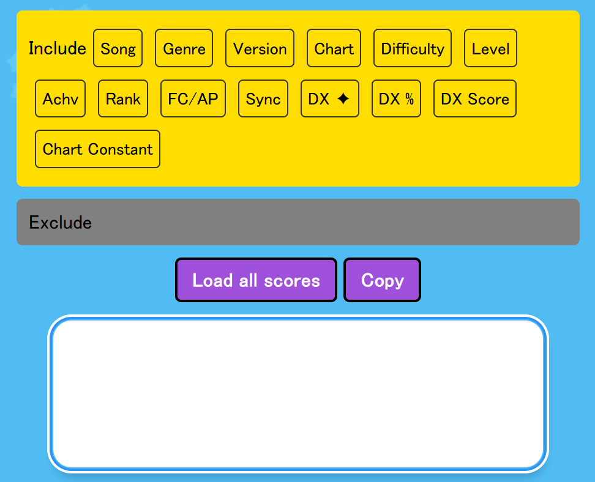
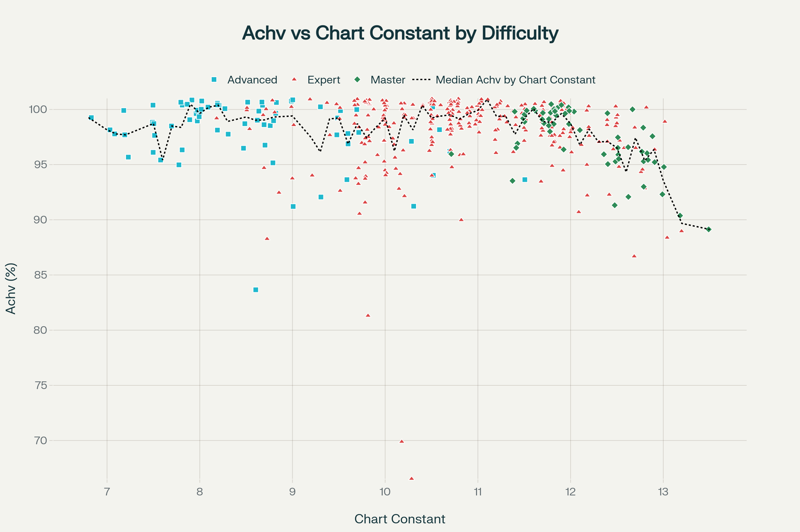

# predicting maimai DX Achievement rate

## Before begining

* Very sensitive to `train_test_split()` data distribution
  * E.g. model tends to get better performance on `random_state=42` but worse on random seeds like `random_state=None`
  * Author note: This might be due to future data leakage, where the `Chart Constant` serve as a proxy for timestamp, because player skill generally improves over time and able to play harder songs later.
* Without filtering *outlier* (debatable) data:
  * Linear Regression: $R^2 \leq 0.1$
  * Random Forest Regression: $R^2 \leq 0.2$
* With filtering *outlier* data (e.g. `Achv >= 85`):
  * Linear Regression: $R^2 \leq 0.3$
  * Random Forest Regression: $R^2 \leq 0.4$
* Key predictors missing
  * When the player played the songs
  * Number of retries
  * Player's physical and mental condition when playing the songs
  * `noteCount` data missing for some songs
  * (Data limitation) Only best scores are recorded, not all of the attempts. This might skew results towards [Extreme Value Theorem](https://en.wikipedia.org/wiki/Fisher%E2%80%93Tippett%E2%80%93Gnedenko_theorem).

## How to obtain the CSV dataset

### maimai.csv

This is your personal score.

Install the following bookmarklet and go to your <https://maimaidx-eng.com/maimai-mobile/home/>, and run it:

```javascript
javascript:(function(d){if(["https://maimaidx.jp","https://maimaidx-eng.com"].indexOf(d.location.origin)>=0){var s=d.createElement("script");s.src="https://myjian.github.io/mai-tools/scripts/all-in-one.js?t="+Math.floor(Date.now()/60000);d.body.append(s);}})(document)
```



Then click "Load all scores", copy the results, and paste it into your spreadsheet software (e.g. Excel), and export it as CSV (Comma-Separated Values, UTF-8) format.

### bpm.csv, songs.csv, etc

Thanks <https://github.com/zetaraku/arcade-songs-fetch> for the effort!

Run the maimai-related scripts, and export the SQLite databases to CSV files (e.g. by using an VSCode SQLite extension).

## How to run

This project uses the [`uv`](https://docs.astral.sh/uv/) package manager.

```bash
git clone https://github.com/eric15342335/maimai-dx-regression
cd maimai-dx-regression
git submodule update --init --recursive --remote
pip install -U uv
uv sync
```

> `--remote` in `git submodule update` uses the latest commit from the submodule repository instead of the pinned commit in this repository.

Then, open `model.ipynb` in VSCode, activate the `.venv` virtual environment, and run the notebook cells step by step.

## Some other visualizations



## Todo

* Add more details about the instructions on this README.md
* Write a blog on my personal website, talking about how'd I get till here~
* Tackle with the flawed assumptions of the data/ML pipeline itself (e.g. future data leakage for train/test split, missing timestamp data, etc)

Discussions are welcome! ~~I love Salt, do you?~~

[Back to top](#predicting-maimai-dx-achievement-rate)
