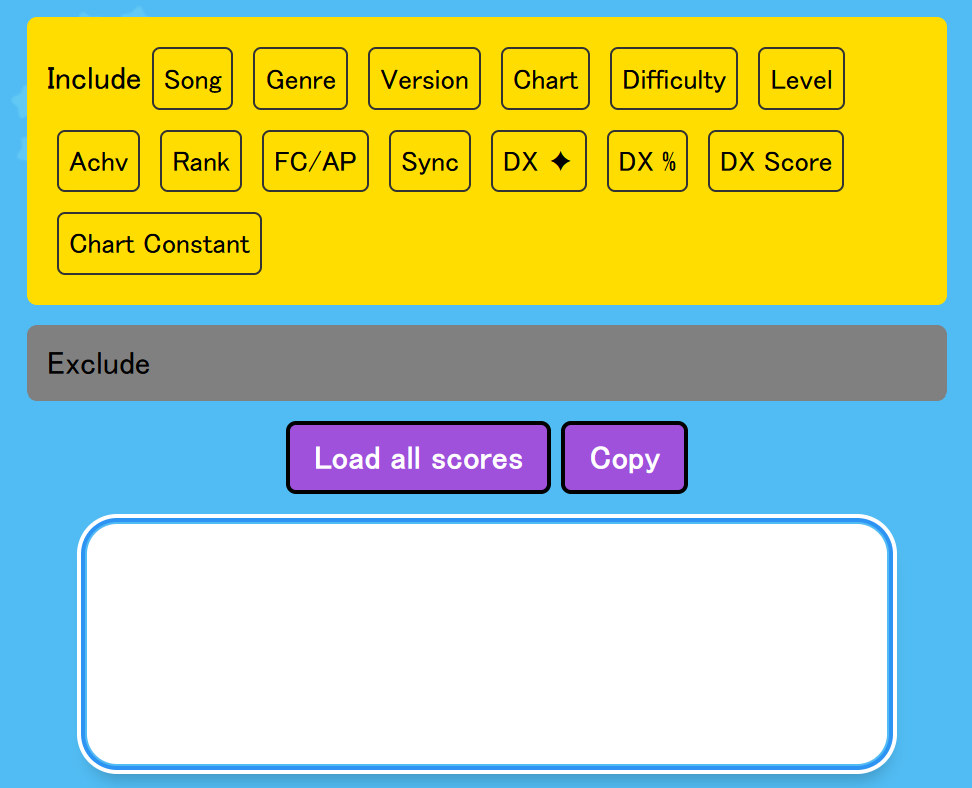
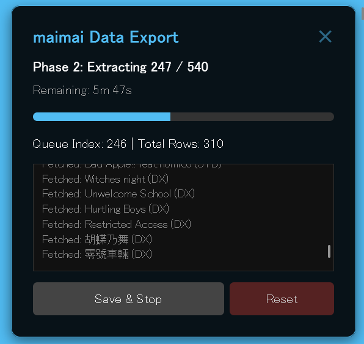
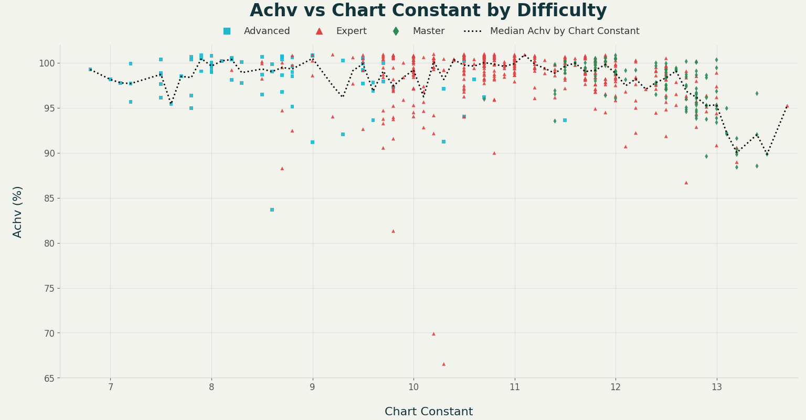

# predicting maimai DX Achievement rate

## Before beginning

* Key predictors missing
  * When the player played the songs (currently only have the last played date)
  * Player's physical and mental condition when playing the songs
  * (Data limitation) Only best scores are recorded, not all of the attempts. This might skew results towards [Extreme Value Theorem](https://en.wikipedia.org/wiki/Fisher%E2%80%93Tippett%E2%80%93Gnedenko_theorem).

## How to obtain the CSV dataset

### maimai.csv

This is your personal score.

Install the following bookmarklet and go to your <https://maimaidx-eng.com/maimai-mobile/home/>, and run it:

```javascript
javascript:(function(d){if(["https://maimaidx.jp","https://maimaidx-eng.com"].indexOf(d.location.origin)>=0){var s=d.createElement("script");s.src="https://myjian.github.io/mai-tools/scripts/all-in-one.js?t="+Math.floor(Date.now()/60000);d.body.append(s);}})(document)
```



Then click "Load all scores", copy the results, and paste it into your spreadsheet software (e.g. Excel), and export it as CSV (Comma-Separated Values, UTF-8) format.

### bpm.csv, songs.csv

Thanks <https://github.com/zetaraku/arcade-songs-fetch> for the effort!

Run the maimai-related scripts, and export the SQLite databases to CSV files (e.g. by using an VSCode SQLite extension).

Quirks I have been running into:

* Google API key needed for fetching spreadsheet data
* For Windows, `pnpm config set script-shell "/path/to/bash.exe"` is needed (using `pnpm` as an example here)
* Comment out these in `tsconfig.json`:

```json
  // This is an alias to @tsconfig/node16: https://github.com/tsconfig/bases
  "extends": "ts-node/node16/tsconfig.json",
```

### playcount.csv



Go to <https://maimaidx-eng.com/maimai-mobile/record/musicGenre/search/?genre=99&diff=3> and run the following script in the browser console:

```js
(async function() {
    const REQUEST_DELAY = 500;
    const STORAGE_KEY = 'maimai_full_extraction_data';
    const DIFFS = [0, 1, 2, 3, 4];

    let cache = JSON.parse(localStorage.getItem(STORAGE_KEY)) || {
        stage: 'discovery',
        diffIndex: 0,
        extractionQueue: [],
        extractionIndex: 0,
        results: []
    };

    const overlay = document.createElement('div');
    overlay.innerHTML = `
        <div id="scraper-ui" style="position:fixed;top:10px;right:10px;z-index:9999;background:rgba(0,0,0,0.9);color:#fff;padding:20px;border-radius:8px;width:320px;font-family:sans-serif;box-shadow:0 4px 12px rgba(0,0,0,0.5);border:1px solid #51bcf3;">
            <div style="margin-bottom:10px;font-weight:bold;color:#51bcf3;display:flex;justify-content:space-between;">
                <span>maimai Data Export</span>
                <span id="close-ui" style="cursor:pointer;opacity:0.5">✕</span>
            </div>
            <div id="status" style="font-size:13px;">Preparing discovery...</div>
            <div id="eta" style="font-size:12px;color:#aaa;margin-top:4px;">Calculating...</div>
            <div style="width:100%;background:#333;height:8px;margin:12px 0;border-radius:4px;overflow:hidden">
                <div id="bar" style="width:0%;background:#51bcf3;height:100%;transition:width 0.3s"></div>
            </div>
            <div id="stats" style="font-size:12px;margin-bottom:10px">Queue: 0 | Total Rows: 0</div>
            <div id="log" style="font-size:10px;height:100px;overflow-y:auto;background:#111;padding:8px;border:1px solid #333;color:#888;margin-bottom:10px;line-height:1.4;"></div>
            <div style="display:flex;gap:5px;">
                <button id="stop-btn" style="flex:2;background:#444;color:white;border:none;padding:8px;border-radius:4px;cursor:pointer;font-size:12px;">Save & Stop</button>
                <button id="reset-btn" style="flex:1;background:#552222;color:#ccc;border:none;padding:8px;border-radius:4px;cursor:pointer;font-size:12px;">Reset</button>
            </div>
        </div>
    `;
    document.body.appendChild(overlay);

    const logEl = document.getElementById('log');
    const barEl = document.getElementById('bar');
    const statusEl = document.getElementById('status');
    const etaEl = document.getElementById('eta');
    const statsEl = document.getElementById('stats');
    
    let isRunning = true;
    let currentDelay = REQUEST_DELAY;
    let sessionStartTime = null;

    function updateLog(msg) {
        const div = document.createElement('div');
        div.innerText = msg;
        logEl.appendChild(div);
        logEl.scrollTop = logEl.scrollHeight;
    }

    function save() { localStorage.setItem(STORAGE_KEY, JSON.stringify(cache)); }

    function downloadCSV() {
        if (cache.results.length === 0) return;
        const headers = ["Name", "Version", "Difficulty", "Level", "Achievement", "Play Count", "Last Played"];
        const csv = [headers.join(","), ...cache.results.map(r => 
            `"${r.name.replace(/"/g, '""')}","${r.version}","${r.difficulty}","${r.level}","${r.achievement}",${r.play_count},"${r.last_played}"`
        )].join("\n");
        const blob = new Blob([new Uint8Array([0xEF, 0xBB, 0xBF]), csv], { type: 'text/csv;charset=utf-8;' });
        const link = document.createElement("a");
        link.href = URL.createObjectURL(blob);
        link.download = `maimai_export_${new Date().getTime()}.csv`;
        link.click();
    }

    document.getElementById('stop-btn').onclick = () => { isRunning = false; };
    document.getElementById('close-ui').onclick = () => { overlay.remove(); };
    document.getElementById('reset-btn').onclick = () => {
        if(confirm("Clear progress and cache?")) {
            localStorage.removeItem(STORAGE_KEY);
            location.reload();
        }
    };

    const request = async (url) => {
        try {
            const resp = await fetch(url);
            if (resp.status === 403 || resp.status === 503) {
                currentDelay = Math.min(currentDelay * 2, 10000);
                updateLog(`Rate limited. Adjusting delay: ${currentDelay}ms`);
                return { error: 'limit' };
            }
            currentDelay = REQUEST_DELAY;
            return { data: await resp.text() };
        } catch (e) { return { error: e.message }; }
    };

    if (cache.stage === 'discovery') {
        const queueSet = new Set(cache.extractionQueue);
        for (let i = cache.diffIndex; i < DIFFS.length; i++) {
            if (!isRunning) break;
            statusEl.innerText = `Phase 1: Discovering played songs (Diff ${i})`;
            const res = await request(`https://maimaidx-eng.com/maimai-mobile/record/musicGenre/search/?genre=99&diff=${DIFFS[i]}`);
            if (res.data) {
                const doc = new DOMParser().parseFromString(res.data, "text/html");
                doc.querySelectorAll('.w_450.m_15').forEach(el => {
                    if (el.querySelector('.music_score_block')) {
                        const idx = el.querySelector('input[name="idx"]')?.value;
                        if (idx) queueSet.add(idx);
                    }
                });
                cache.extractionQueue = Array.from(queueSet);
                cache.diffIndex = i + 1;
                if (cache.diffIndex === DIFFS.length) cache.stage = 'extraction';
                save();
                statsEl.innerText = `Queue: ${cache.extractionQueue.length} | Rows: 0`;
            }
            await new Promise(r => setTimeout(r, currentDelay));
        }
    }

    if (cache.stage === 'extraction' && isRunning) {
        const total = cache.extractionQueue.length;
        const startIndex = cache.extractionIndex;
        sessionStartTime = Date.now();

        // deduplication map to prevent exact row duplicates
        const seenSignatures = new Set(cache.results.map(r => `${r.name}|${r.version}|${r.difficulty}`));

        for (let i = startIndex; i < total; i++) {
            if (!isRunning) break;
            
            const currentNum = i + 1;
            statusEl.innerText = `Phase 2: Extracting ${currentNum} / ${total}`;
            barEl.style.width = `${(currentNum / total) * 100}%`;
            
            if (i > startIndex) {
                const elapsed = Date.now() - sessionStartTime;
                const avg = elapsed / (i - startIndex);
                const remainingMs = (total - currentNum) * avg;
                const mins = Math.floor(remainingMs / 60000);
                const secs = Math.floor((remainingMs % 60000) / 1000);
                etaEl.innerText = `Remaining: ${mins}m ${secs}s`;
            }

            const res = await request(`https://maimaidx-eng.com/maimai-mobile/record/musicDetail/?idx=${encodeURIComponent(cache.extractionQueue[i])}`);
            
            if (res.data) {
                const doc = new DOMParser().parseFromString(res.data, "text/html");
                const songName = doc.querySelector('.f_15.break')?.innerText.trim() || "Unknown";
                const isDx = doc.querySelector('img[src*="music_dx.png"]');
                const version = isDx ? "DX" : "Standard";

                doc.querySelectorAll('.music_master_score_back, .music_expert_score_back, .music_advanced_score_back, .music_basic_score_back, .music_remaster_score_back').forEach(block => {
                    const table = block.querySelector('.black_block table')?.innerText || "";
                    const playCountMatch = table.match(/PLAY COUNT：\s*(\d+)/);
                    
                    if (playCountMatch) {
                        const diff = block.querySelector('img[src*="diff_"]')?.src.split('diff_')[1].split('.png')[0];
                        const signature = `${songName}|${version}|${diff}`;

                        if (!seenSignatures.has(signature)) {
                            cache.results.push({
                                name: songName,
                                version: version,
                                difficulty: diff,
                                level: block.querySelector('.music_lv_back')?.innerText.trim(),
                                achievement: block.querySelector('.music_score_block.w_120')?.innerText.trim(),
                                play_count: playCountMatch[1],
                                last_played: (table.match(/Last played date：\s*([\d/: ]+)/) || [])[1] || "N/A"
                            });
                            seenSignatures.add(signature);
                        }
                    }
                });
                cache.extractionIndex = i + 1;
                save();
                updateLog(`Fetched: ${songName} (${version === "DX" ? "DX" : "STD"})`);
                statsEl.innerText = `Queue Index: ${currentNum} | Total Rows: ${cache.results.length}`;
            }
            await new Promise(r => setTimeout(r, currentDelay));
        }
    }

    if (cache.extractionIndex === cache.extractionQueue.length && cache.stage === 'extraction') {
        localStorage.removeItem(STORAGE_KEY);
        statusEl.innerText = "Complete";
        etaEl.innerText = "CSV Generated";
    }
    downloadCSV();
})();
```

* For `pnpm`, make sure to run `pnpm approve-builds` to download SQLite binaries, otherwise it will error out when running the scripts.
* In `package.json`, comment out `maimai:fetch-images` in `maimai:all` to skip fetching images as we are obviously not training an Convolutional Neural Network (CNN) here to add additional features to our already small dataset (hypothesis: anime girls in the song images might affect player performance). Also, comment out `maimai:fetch-versions` as I don't have an MAIMAI JP account.

## How to run

This project uses the [`uv`](https://docs.astral.sh/uv/) package manager.

```bash
git clone https://github.com/eric15342335/maimai-dx-regression
cd maimai-dx-regression
git submodule update --init --recursive --remote # You can skip this if you don't want to obtain the latest arcade-songs-fetch data
pip install -U uv
uv sync
```

> `--remote` in `git submodule update` uses the latest commit from the submodule repository instead of the pinned commit in this repository.

Then, open `model.ipynb` in VSCode, activate the `.venv` virtual environment, and run the notebook cells step by step.

## Some other visualizations

This visualization is generated via [this script](./visualization.py).



## Todo

* Add more details about the instructions on this README.md
* Write a blog on my personal website, talking about how'd I get till here~
* Tackle with the flawed assumptions of the data/ML pipeline itself (e.g. future data leakage for train/test split, missing timestamp data, etc)

Discussions are welcome! ~~I love Salt, do you?~~

[Back to top](#predicting-maimai-dx-achievement-rate)
